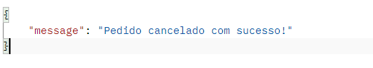

# ATIVIDADE Start-Café ☕

A atividade foi criada para replicar o sistema de gestão de uma cafeteria renomada, chamada Star-Café. Usando JavaScript na programação Back-End, a API possibilita que os clientes realizem pedidos e que o estabelecimento gerencie o estoque de produtos de forma eficiente.

## 📲 Aplicativos Utilizados para realização do projeto
- Visual Studio Code
- Node.js
- Postman
- Git

## 📂 Depêndencias Utilizadas para realização do projeto
- Express
- Uuid
- Dotenv
- Cors
- Nodemon

## 📚 Métodos de API Utilizados
1️⃣ **GET /menu**: Utilizado para buscar todos os itens que estão presentes no cardápio.
2️⃣ **POST /pedidos**: Utilizado para criar novos pedidos.
3️⃣ **GET /pedidos**: Utilizado para buscar todos os pedidos existentes.
4️⃣ **GET /pedidos/:id**: Utilizado para retornar o status de um pedido.
5️⃣ **DELETE /pedidos**: Utilizado para cancelar pedidos que ainda não foram finalizados.

## 📒 Cabeçalhos que aparecerão durante a documentação

- **Content-Type: application/json; charset=utf-8**: Especifica o tipo de mídia da requisição ou resposta. Neste caso, todas as rotas terão o corpo no formato JSON com o padrão de caracteres UTF-8.
- **User-Agent: PostmanRuntime/7.43.0**: Identifica o cliente que está fazendo a requisição. Neste cenário, o cliente é o Postman.
- **Accept: */***: Indica quais tipos de mídia o cliente é capaz de entender. Na atividade, o */* significa que ele aceita qualquer tipo de mídia.
- **Cache-Control: no-cache**: É a instrução para mecanismos de cache. O "no-cache" traduz que o cliente quer uma cópia fresca, forçando a obtenção de uma nova resposta do servidor.
- **Postman-Token**: É um cabeçalho específico do Postman, gerado automaticamente por ele, usado para ajudar a identificar a requisição e evitar repetições.
- **Host: localhost:3000**: Especifica o host e a porta do servidor de destino da requisição. O "localhost:3000" indica que a requisição está sendo enviada para um servidor rodando localmente na porta 3000.
- **Accept-Encoding: gzip, deflate, br**: Demonstra quais esquemas de codificação de conteúdo o cliente suporta. Neste caso, gzip, deflate e br (Brotli) são métodos de compressão usados para reduzir o tamanho dos dados transmitidos.
- **Connection: keep-alive**: Especifica as opções de controle de conexão para a requisição/resposta. O "keep-alive" indica que a conexão deve ser mantida aberta para possíveis requisições subsequentes.
- **Content-Length**: Indica o tamanho do corpo da requisição em bytes.
- **X-Powered-By: Express**: Indica que o servidor que gerou a resposta está usando o framework Express para Node.js.
- **Access-Control-Allow-Origin: ***: Permite que qualquer origem acesse o recurso. Este cabeçalho é parte das configurações de CORS (Cross-Origin Resource Sharing) que permitem o controle de acesso de recursos na web.
- **ETag**: ETag (Entity Tag) é uma identificador único para uma versão específica de um recurso. Esse valor é usado para determinar se o recurso mudou entre solicitações.
- **Date**: Simboliza a data e a hora em que a resposta foi gerada pelo servidor.
- **Keep-Alive: timeout=5**: Especifica o tempo em segundos que a conexão deve ser mantida viva após a resposta inicial, no caso, 5 segundos.

## Endpoints(rotas) Utilizadas no projeto

- 🟢 **<span style="color:green">GET</span> /menu** : Retornará o cardápio da cafeteria.

### **Cabeçalhos HTTP da requisição:**

- **User-Agent**: PostmanRuntime/7.43.0
- **Accept**: */*
- **Cache-Control**: no-cache
- **Postman-Token**: ccad05e2-ec07-46dc-a39a-985822664e40
- **Host**: localhost:4000
- **Accept-Encoding**: gzip, deflate, br
- **Connection**: keep-alive

### **Cabeçalhos HTTP da resposta:**

- **X-Powered-By**: Express
- **Access-Control-Allow-Origin**: *
- **Content-Type**: application/json; charset=utf-8
- **Content-Length**: 494
- **ETag**: W/"1ee-UrLg/fduK8aTR1SQ2xs1UpoI7X4"
- **Date**: Wed, 19 Feb 2025 00:18:56 GMT
- **Connection**: keep-alive
- **Keep-Alive**: timeout=5

### **Corpo da Resposta(JSON)**


### **Código de Status**

- **🟩 200 OK**: A solicitação foi bem-sucedida e o cardápio foi retornado.
- **🟥 404 Not Found**: O cardápio não foi encontrado(❌ Erro do cliente).

- 🟢 **<span style="color:green">GET</span> /pedidos** : Retornará todos os pedidos que foram efetuados.

### **Cabeçalhos HTTP da requisição:**

- **User-Agent**: PostmanRuntime/7.43.0
- **Accept**: */*
- **Cache-Control**: no-cache
- **Postman-Token**: 99e4674a-97d8-4b73-bc82-201f709c46f0
- **Host**: localhost:4000
- **Accept-Encoding**: gzip, deflate, br
- **Connection**: keep-alive

### **Cabeçalhos HTTP da resposta:**

- **X-Powered-By**: Express
- **Access-Control-Allow-Origin**: *
- **Content-Type**: application/json; charset=utf-8
- **Content-Length**: 1134
- **ETag**: W/"46e-6ZDAkhFCv1bklkCOa6k4IPI+XNE
- **Date**: Wed, 19 Feb 2025 00:12:04 GMT
- **Connection**: keep-alive
- **Keep-Alive**: timeout=5

### **Corpo da Resposta(JSON)**


### **Código de Status**

- **🟩 200 OK**: A solicitação foi bem-sucedida e o pedido foi retornado.
- **🟥 404 Not Found**: O pedido não foi encontrado(❌ Erro do cliente).

- 🟠 **<span style="color:orange">POST</span> /pedidos** : O cliente fará um novo pedido.

### **Cabeçalhos HTTP da requisição:**

- **Content-Type**: application/json
- **User-Agent**: PostmanRuntime/7.43.0
- **Accept**: */*
- **Cache-Control**: no-cache
- **Postman-Token**: acc4c624-f9b0-47ad-8020-9289bb17c3e5
- **Host**: localhost:4000
- **Accept-Encoding**: gzip, deflate, br
- **Connection**: keep-alive
- **Content-Length**: 97

### **Cabeçalhos HTTP da resposta:**

- **X-Powered-By**: Express
- **Access-Control-Allow-Origin**: *
- **Content-Type**: application/json; charset=utf-8
- **Content-Length**: 184
- **ETag**: W/"b8-VRdWZGvM9glovEgjsX8WiaNgtz8
- **Date**: Wed, 19 Feb 2025 00:25:12 GMT
- **Connection**: keep-alive
- **Keep-Alive**: timeout=5

### **Corpo da Requisição(JSON)**

```json
{
    "cliente": "Laura",
    "tipo": "salgado",
    "descricao": "coxinha",
    "valor": 5
}
```

### **Corpo da Resposta(JSON)**


### **Código de Status**

- **🟩 200 OK**: O pedido foi criado e registrado com sucesso.
- **🟥 404 Not Found**: Os compos obrigátorios não foram prrenchidos(❌ Erro do cliente).


- 🟢 **<span style="color:green">GET</span> /pedidos/:id** : Retornará os status de um pedido específico.

### **Cabeçalhos HTTP da requisição:**

- **User-Agent**: PostmanRuntime/7.43.0
- **Accept**: */*
- **Cache-Control**: no-cache
- **Postman-Token**: eca4ff22-d837-431e-89b1-720c638df260
- **Host**: localhost:4000
- **Accept-Encoding**: gzip, deflate, br
- **Connection**: keep-alive

### **Cabeçalhos HTTP da resposta:**

- **X-Powered-By**: Express
- **Access-Control-Allow-Origin**: *
- **Content-Type**: application/json; charset=utf-8
- **Content-Length**: 40
- **ETag**: W/"28-ufpJ9QZLqjicn28lXMVBKv0bUoI
- **Date**: Wed, 19 Feb 2025 00:43:13 GMT
- **Connection**: keep-alive
- **Keep-Alive**: timeout=5

### **Corpo da Resposta(JSON)**


### **Código de Status**

- **🟩 200 OK**: A solicitação do status do pedido foi retornada com sucesso.
- **🟥 404 Not Found**: O pedido não foi encontrado.


- 🔴 **<span style="color:red">DELETE</span> /pedidos/:id** : Irá cancelar um pedido que está como status = pendente.

### **Cabeçalhos HTTP da requisição:**

- **User-Agent**: PostmanRuntime/7.43.0
- **Accept**: */*
- **Cache-Control**: no-cache
- **Postman-Token**: eca4ff22-d837-431e-89b1-720c638df260
- **Host**: localhost:4000
- **Accept-Encoding**: gzip, deflate, br
- **Connection**: keep-alive

### **Cabeçalhos HTTP da resposta:**

- **X-Powered-By**: Express
- **Access-Control-Allow-Origin**: *
- **Content-Type**: application/json; charset=utf-8
- **Content-Length**: 40
- **ETag**: W/"28-ufpJ9QZLqjicn28lXMVBKv0bUoI
- **Date**: Wed, 19 Feb 2025 00:43:13 GMT
- **Connection**: keep-alive
- **Keep-Alive**: timeout=5

### **Corpo da Resposta(JSON)**




### **Código de Status**

- **🟩 200 OK**: O pedido foi cancelado com sucesso.
- **🟥 404 Not Found**: O pedido não foi encntrado.
- **🟥 403 Not Found**: Pedido já foi concluído, não pode ser cancelado.


